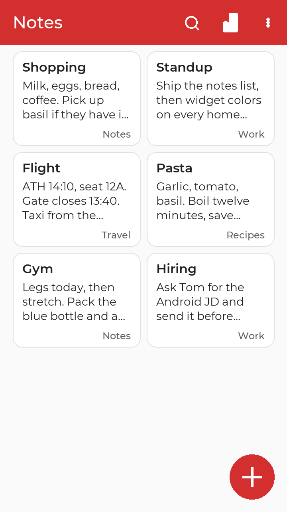
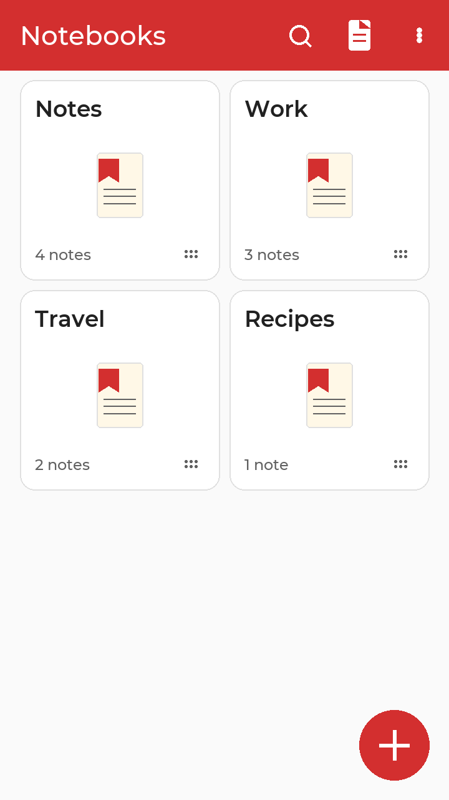
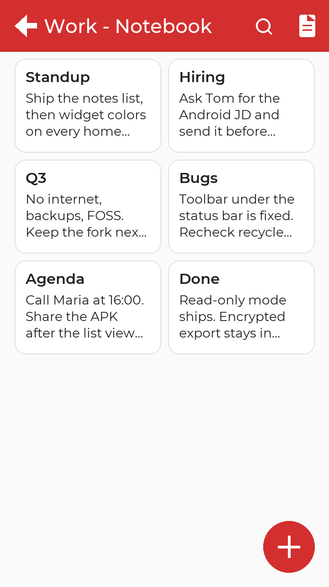
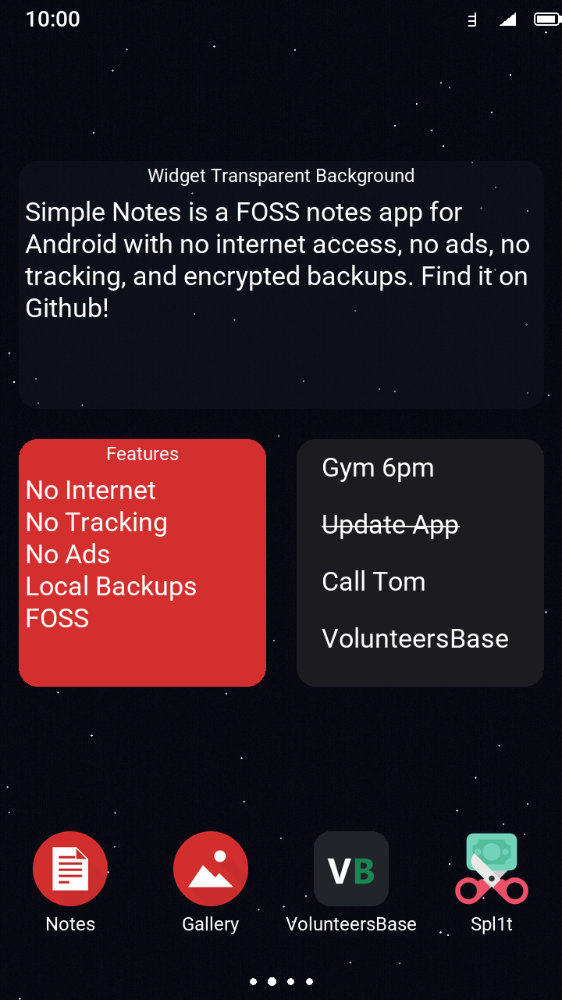

# Simple Notes

No ads or unnecessary permissions. It is fully open source and provides customizable colors. The lack of internet access and encrypted exports gives you more privacy than typical note apps.

## History

Simple-Notes (GPL-3.0) was my favorite FOSS notes app until the project was sold to a shady Israeli company named ZipoApps in 2023. I forked it to keep it alive, FOSS and updated. I will release new versions as long as I have time and energy. Code contributions on Github are very welcome :)

This fork is not affiliated with Simple Mobile Tools, Fossify or ZipoApps.

APKs are published on [GitHub Releases](https://github.com/t0ma5/Simple-Notes/releases)
- `Simple-Notes_<version>-FOSS-arm64-v8a.apk` (most phones)
- `Simple-Notes_<version>-FOSS-armeabi-v7a.apk`
- `Simple-Notes_<version>-FOSS-x86_64.apk` (emulators)
- `Simple-Notes_<version>-FOSS-universal.apk` (all included)

## New features in this fork

The Simple Notes Pro workflow, plus notebooks, locks, and a recycle bin. Still offline, still GPL-3.0.

**Organize**
- **Notebooks** — Create, rename, pin, reorder, lock, and delete collections of notes. A toolbar icon switches a two-column notes grid and the notebooks screen (notes is the default).
- **Search and tags** — Find notes, notebooks, and tags from one screen. Move a note to another notebook, or send selected checklist items to a different note.
- **Recycle bin** — Restore deleted notes and notebooks.

**Private**
- **Lock** a note or a whole notebook with fingerprint, pattern, or PIN. Locked cards hide their preview until you unlock.
- **Read-only** — Freeze a text note, checklist, or counter so it cannot be edited by accident.
- **Encrypted exports** — AES with a password, or plain text with none.

**Write**
- Text notes with Markdown preview, checklists, and counter notes with colored +/− buttons.
- Undo and redo. Paste as plain text; composing keyboards still work.
- Checklists: uncheck all, collapse checked items, sort each list on its own.

**Home screen**
- Notes widgets and a notebook widget. Customize widget colors once; every widget updates.

**No nags**
- No donation, rate, or “what’s new” popups. Own app ID (`tomato.simple.notes`) so it can sit next to Simple Notes Pro.

## Build

Release APKs come from `assembleCoreRelease` (local and GitHub Actions). Names:

- `Simple-Notes_<version>-FOSS-arm64-v8a.apk`
- `Simple-Notes_<version>-FOSS-armeabi-v7a.apk`
- `Simple-Notes_<version>-FOSS-x86_64.apk`
- `Simple-Notes_<version>-FOSS-universal.apk`

| Item | Value |
| --- | --- |
| App version | 6.18.0 (versionCode 124) |
| minSdk | 23 |
| targetSdk / compileSdk | 36 (Android 16) |
| JVM bytecode | 17 |
| Gradle | 9.1.0 |
| Android Gradle Plugin | 8.13.2 |
| Kotlin / KSP | 2.2.10 |
| Room | 2.8.4 |
| Local JDK | 25 (do not point Gradle at JDK 17) |
| CI JDK | Temurin 17 |
| Commons | `SimpleMobileTools/Simple-Commons` @ `eceb48949e`, patched by `python scripts/patch_commons.py` |

Checkout Simple-Commons next to the app (gitignored `Simple-Commons/`), run `python scripts/patch_commons.py`, then `./gradlew assembleCoreRelease`. When that directory exists, Gradle `includeBuild`s it instead of the JitPack AAR. Sign with gitignored `keystore.properties` and `app/keystore.jks` (GitHub secrets `KEYSTORE_BASE64`, `KEYSTORE_PASSWORD`, `KEY_ALIAS`, `KEY_PASSWORD`).
